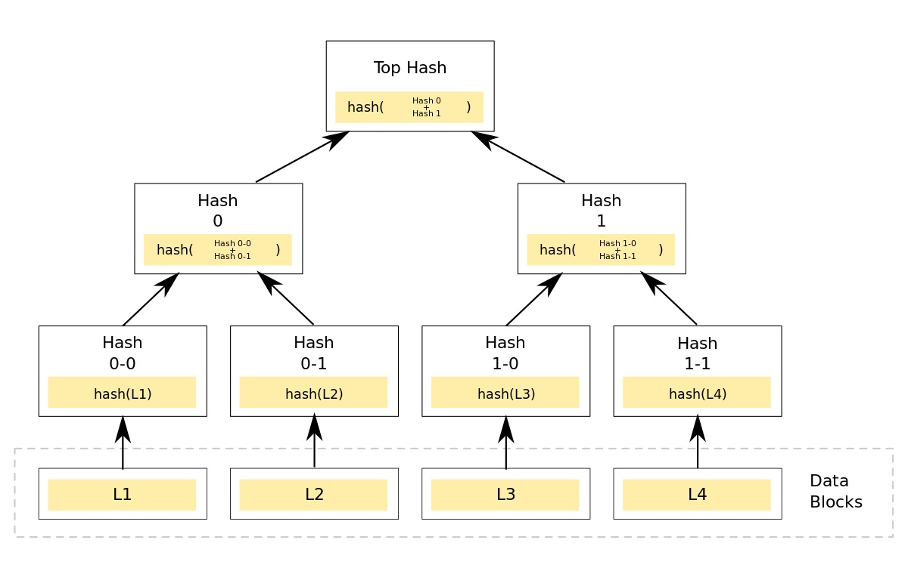

# Stratumn Merkle Tree Challenge

_Please do not upload this to a public repository._

A Merkle Tree is a relatively simple structure to verify the integrity of data. It is a binary tree where each node contains a cryptographic hash of its two children:

```
h_parent = hash(h_left + h_right)
```

If a node has only one child, its hash is the same as that of its child. The hash of the root of the tree is called the Merkle root. The leaves of the tree contain the hashes of the data blocks.



## Part 1 - Exercise

Using Node.js (typescript is preferable :wink:) or Go, write a module to create a Merkle tree from a set of data (in the illustration this would be data L1, L2, L3, and L4).

For example:

```
createMerkleTree([string1, string2, string3, ...]) => MerkleTree
```

The created Merkle tree must have the following functions:

```
// Return the hash at the root of the tree 
MerkleTree#root()

// Return the number of levels in the tree 
MerkleTree#height()

// Return an Array containing the hashes of the specified level
MerkleTree#level(index)
```

The hashes are calculated using the SHA256 cryptographic function (see the crypto package of node.js).


## Part 2 - Questions

_Feel free to add your answers directly in this readme, or in a separeate file._

1. In the illustration, let's imagine that I have the Merkle tree. Someone gives me the L2 data block but I don't trust him. How can I check if the data in L2 is valid?

1. I have the L3 block and a Merkle root. However, I do not have the other blocks or the Merkle tree. What is the minimum information I need to ensure that block L3 is part of the Merkle tree that is rooted by the Merkle root I have?

1. What are some examples of applications for a Merkle tree?

## What to submit

Make sure you do your work in a separate branch (so not on master). When you are done you can push your branch to this repo and create a pull request to the master branch. Feel free to email us if you are not familiar with github 🙂